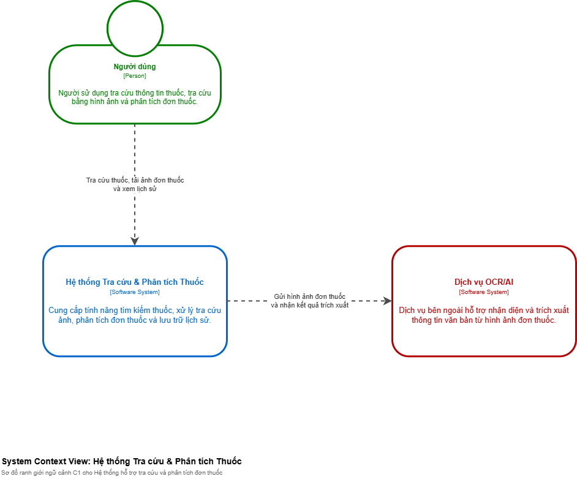
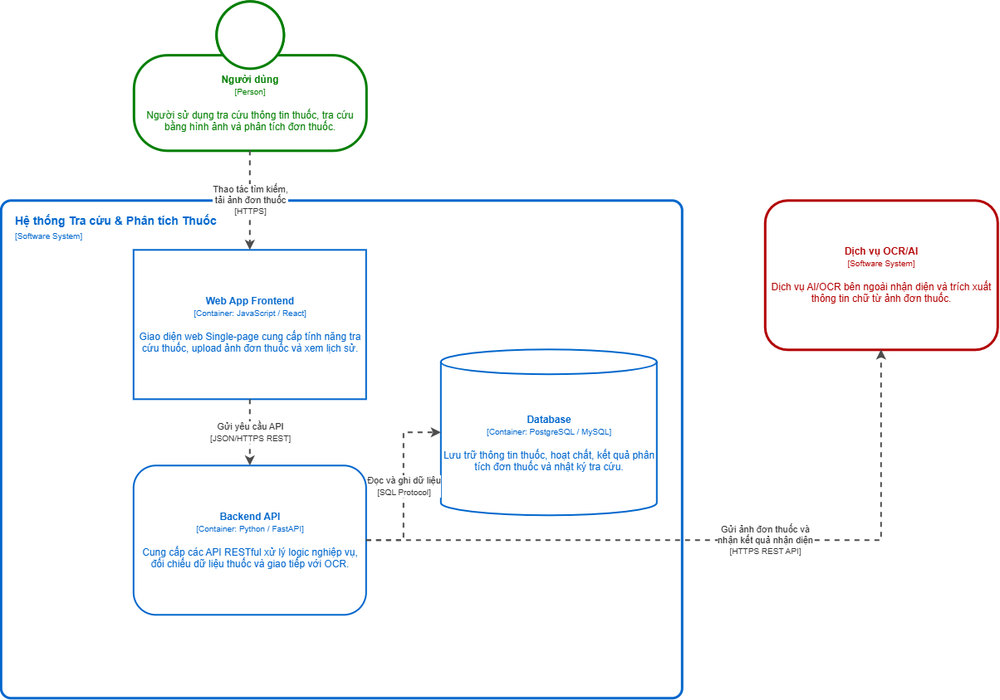

# **System Context Diagram ( Biểu đồ C4 mức 1 )**

Sơ đồ C1 thể hiện bức tranh tổng quan ở mức cao nhất, xác định ranh giới hệ thống và các đối tác tương tác bên ngoài.

* **Đối tượng người dùng:**
  * **Người dùng:** Đại diện cho người sử dụng cuối (bệnh nhân, người dân).
  * **Vai trò:** Thực hiện các thao tác tra cứu thông tin thuốc, tải ảnh đơn thuốc để phân tích và xem lại lịch sử tra cứu.

* **Hệ thống trung tâm:**
  * **Hệ thống Tra cứu & Phân tích Thuốc:** Đóng vai trò là điểm tập trung xử lý toàn bộ yêu cầu. Cung cấp tính năng tìm kiếm thông tin thuốc, tiếp nhận ảnh đơn thuốc, điều phối trích xuất và lưu lịch sử.

* **Hệ thống bên ngoài:**
  * **Dịch vụ OCR/AI:** Là bên thứ ba cung cấp khả năng nhận diện ký tự quang học (OCR) và mô hình AI xử lý hình ảnh.

* **Luồng tương tác:**
  * Người dùng gửi yêu cầu (tra cứu, gửi ảnh) đến Hệ thống.
  * Hệ thống chuyển giao hình ảnh đơn thuốc tới Dịch vụ OCR/AI để trích xuất dữ liệu chữ/văn bản và nhận lại kết quả phân tích.

Ảnh sơ đồ:

  

# **Container Diagram ( Biểu đồ C4 mức 2 )**

Sơ đồ C2 đi sâu vào bên trong hệ thống trung tâm, phân rã "Hệ thống Tra cứu & Phân tích Thuốc" thành các khối ứng dụng (Container) độc lập và chỉ rõ công nghệ sử dụng.

### **Phạm vi hệ thống**
Bao bọc 3 khối Container chính cấu thành nên hệ thống.

---

### **Chi tiết các Container bên trong**

* **Web App Frontend (`JavaScript / React`)**
  * **Chức năng:** Giao diện người dùng dạng Single-Page Application (SPA). Cho phép người dùng tương tác trực tiếp: gõ tìm kiếm, tải tệp đơn thuốc, hiển thị kết quả phân tích và lịch sử.
  * **Giao tiếp:** Nhận thao tác từ người dùng qua HTTPS; gọi đến Backend API thông qua chuẩn JSON/HTTPS REST.

* **Backend API (`Python / FastAPI`)**
  * **Chức năng:** Trái tim xử lý logic nghiệp vụ. Tiếp nhận yêu cầu từ Web Frontend, xử lý logic tìm kiếm, đối chiếu dữ liệu thuốc, và đóng vai trò trung gian gửi/nhận dữ liệu với OCR bên ngoài.
  * **Giao tiếp:** Đọc/ghi dữ liệu xuống Database qua SQL Protocol; gọi Dịch vụ OCR/AI bên ngoài qua HTTPS REST API.

* **Database (`PostgreSQL / MySQL`)**
  * **Chức năng:** Cơ sở dữ liệu quan hệ lưu trữ dữ liệu bền vững. Bao gồm: danh mục thông tin thuốc, thông tin hoạt chất, lịch sử phân tích đơn thuốc và log hệ thống.

Ảnh sơ đồ:

  

