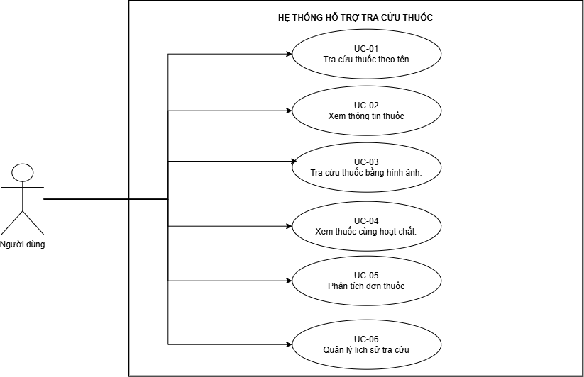
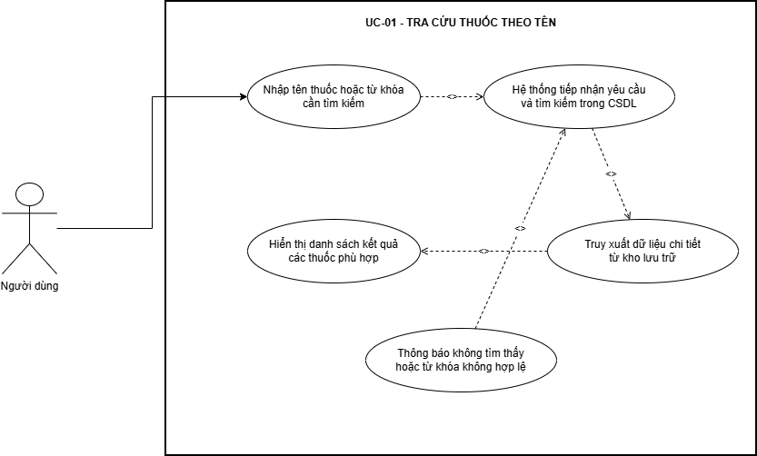
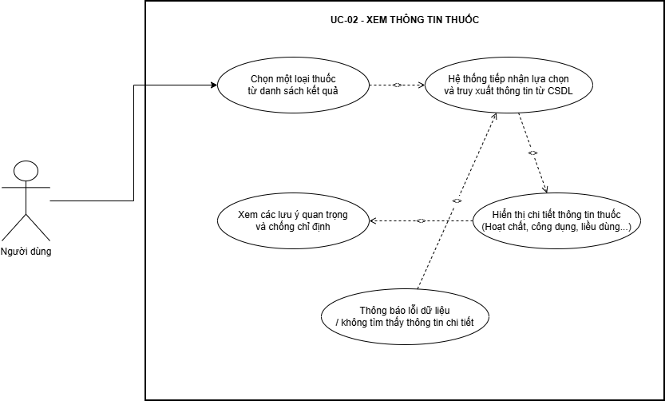
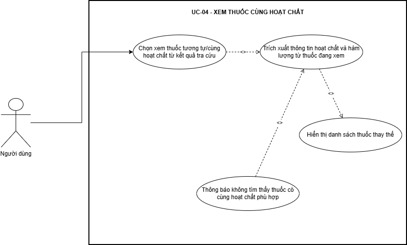
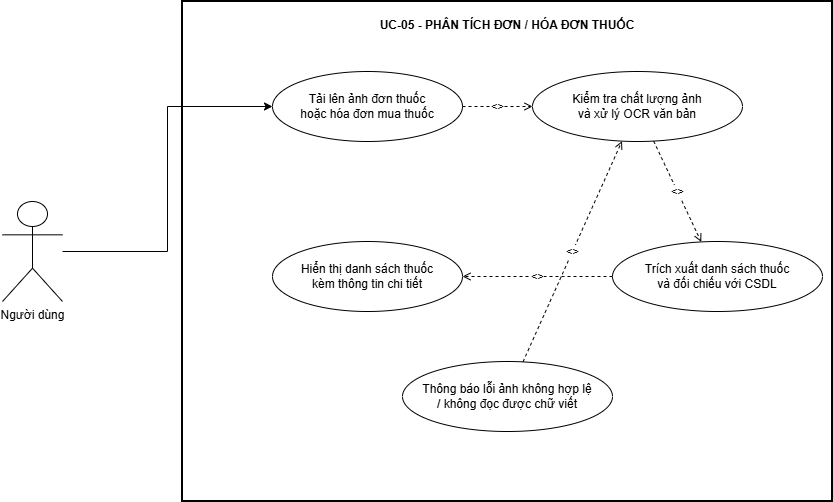
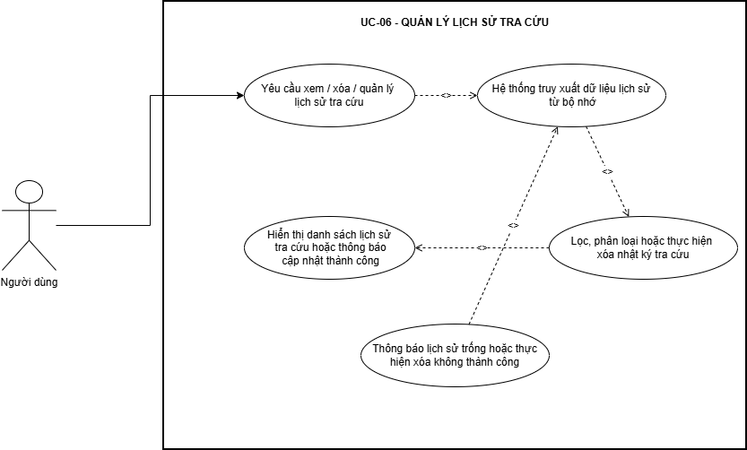

## Use Case Diagram Tổng thể

  

## Use Case Diagram phân rã theo chức năng

### UC-01: Tra cứu thuốc theo tên

  

### UC-02: Xem thông tin thuốc

  

### UC-03: Tra cứu thuốc bằng hình ảnh

  

### UC-04: Xem thuốc cùng hoạt chất

  

### UC-05: Phân tích đơn thuốc

  

### UC-06: Quản lý lịch sử tra cứu

  

