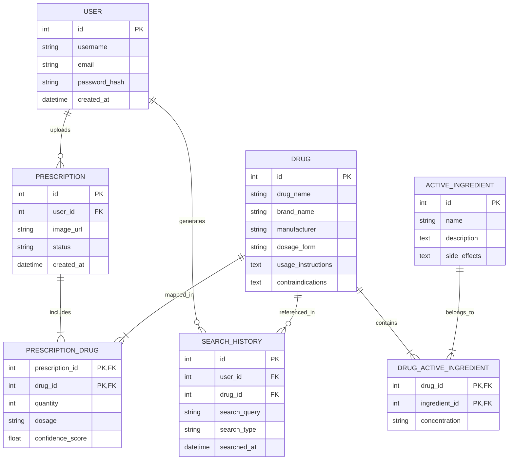

# Thiết Kế Cơ Sở Dữ Liệu (Database Design)

Cơ sở dữ liệu của hệ thống được thiết kế theo mô hình quan hệ (Relational Database Model) và tuân thủ chuẩn hóa **3NF (Third Normal Form)** nhằm giảm thiểu tối đa sự dư thừa dữ liệu, tránh hiện tượng bất thường khi thêm/sửa/xóa và đảm bảo tính nhất quán dữ liệu.

---

## Thiết Kế Biểu Đồ Thực Thể - Liên Kết (ERD)

### Các thực thể chính trong hệ thống:
* **User:** Lưu thông tin tài khoản người dùng hệ thống.
* **Drug:** Lưu thông tin chi tiết về các loại thuốc.
* **ActiveIngredient:** Lưu danh mục các hoạt chất hóa học.
* **DrugActiveIngredient:** Bảng trung gian giải quyết quan hệ N-N giữa Thuốc và Hoạt chất (chứa thông tin nồng độ/hàm lượng).
* **SearchHistory:** Lưu lịch sử tra cứu thuốc và từ khóa của người dùng.
* **Prescription:** Lưu thông tin hình ảnh và trạng thái xử lý các đơn thuốc do người dùng tải lên.
* **PrescriptionDrug:** Bảng trung gian giải quyết quan hệ N-N giữa Đơn thuốc và Thuốc (lưu số lượng, liều dùng và độ tin cậy OCR).

### Quan hệ chính giữa các thực thể:
* Một **Drug** có thể chứa một hoặc nhiều **ActiveIngredient**, và ngược lại một **ActiveIngredient** có thể xuất hiện trong nhiều **Drug** (Quan hệ N-N thông qua bảng `DrugActiveIngredient`).
* Một **User** có thể tải lên nhiều **Prescription** (Quan hệ 1-N).
* Một **Prescription** có thể chứa nhiều **Drug**, và một **Drug** có thể xuất hiện trong nhiều **Prescription** (Quan hệ N-N thông qua bảng `PrescriptionDrug`).
* Một **User** có thể tạo ra nhiều lượt **SearchHistory** (Quan hệ 1-N).

### Sơ đồ ERD (Mermaid Diagram)

 ## Từ Điển Dữ Liệu (Data Dictionary)

Bảng dưới đây mô tả chi tiết danh sách các bảng, trường dữ liệu, kiểu dữ liệu, các ràng buộc (Khóa chính PK, Khóa ngoại FK, Not Null, Index) trong cơ sở dữ liệu:

| Bảng | Trường Dữ Liệu | Kiểu Dữ Liệu | Ràng Buộc | Mô Tả |
| :--- | :--- | :--- | :--- | :--- |
| **User** | `id` | `INT` | `PK, AUTO_INCREMENT` | Mã định danh người dùng |
| | `username` | `VARCHAR(50)` | `NOT NULL, UNIQUE` | Tên đăng nhập |
| | `email` | `VARCHAR(100)` | `NOT NULL, UNIQUE` | Địa chỉ email |
| | `password_hash` | `VARCHAR(255)` | `NOT NULL` | Mật khẩu mã hóa |
| | `created_at` | `DATETIME` | `DEFAULT CURRENT_TIMESTAMP` | Thời gian tạo tài khoản |
| **Drug** | `id` | `INT` | `PK, AUTO_INCREMENT` | Mã định danh thuốc |
| | `drug_name` | `VARCHAR(255)` | `NOT NULL, INDEX` | Tên thương mại / Tên gốc thuốc |
| | `brand_name` | `VARCHAR(255)` | `NULL` | Biệt dược |
| | `manufacturer` | `VARCHAR(255)` | `NULL` | Nhà sản xuất |
| | `dosage_form` | `VARCHAR(100)` | `NULL` | Dạng bào chế (Viên, Siro, ...) |
| | `usage_instructions` | `TEXT` | `NULL` | Hướng dẫn sử dụng |
| | `contraindications` | `TEXT` | `NULL` | Chống chỉ định |
| **ActiveIngredient** | `id` | `INT` | `PK, AUTO_INCREMENT` | Mã định danh hoạt chất |
| | `name` | `VARCHAR(255)` | `NOT NULL, INDEX` | Tên hoạt chất |
| | `description` | `TEXT` | `NULL` | Mô tả chi tiết hoạt chất |
| | `side_effects` | `TEXT` | `NULL` | Tác dụng phụ |
| **DrugActiveIngredient** | `drug_id` | `INT` | `PK, FK → Drug.id` | Mã thuốc |
| | `ingredient_id` | `INT` | `PK, FK → ActiveIngredient.id` | Mã hoạt chất |
| | `concentration` | `VARCHAR(100)` | `NULL` | Hàm lượng / Nồng độ |
| **SearchHistory** | `id` | `INT` | `PK, AUTO_INCREMENT` | Mã bản ghi lịch sử |
| | `user_id` | `INT` | `FK → User.id` | Người thực hiện tìm kiếm |
| | `drug_id` | `INT` | `FK → Drug.id, NULL` | Thuốc được truy cập (nếu có) |
| | `search_query` | `VARCHAR(255)` | `NOT NULL` | Từ khóa tra cứu |
| | `search_type` | `VARCHAR(50)` | `NOT NULL` | Loại tìm kiếm (`text`, `image`) |
| | `searched_at` | `DATETIME` | `DEFAULT CURRENT_TIMESTAMP` | Thời gian tra cứu |
| **Prescription** | `id` | `INT` | `PK, AUTO_INCREMENT` | Mã đơn thuốc |
| | `user_id` | `INT` | `FK → User.id` | Người tải đơn thuốc |
| | `image_url` | `VARCHAR(500)` | `NOT NULL` | Đường dẫn lưu ảnh |
| | `status` | `VARCHAR(50)` | `NOT NULL` | Trạng thái (`processing`, `completed`) |
| | `created_at` | `DATETIME` | `DEFAULT CURRENT_TIMESTAMP` | Thời gian tải lên |
| **PrescriptionDrug** | `prescription_id` | `INT` | `PK, FK → Prescription.id` | Mã đơn thuốc |
| | `drug_id` | `INT` | `PK, FK → Drug.id` | Mã thuốc được bóc tách |
| | `quantity` | `INT` | `NULL` | Số lượng thuốc |
| | `dosage` | `VARCHAR(255)` | `NULL` | Liều dùng chỉ định |
| | `confidence_score` | `FLOAT` | `NULL` | Mức độ tin cậy nhận diện OCR |
