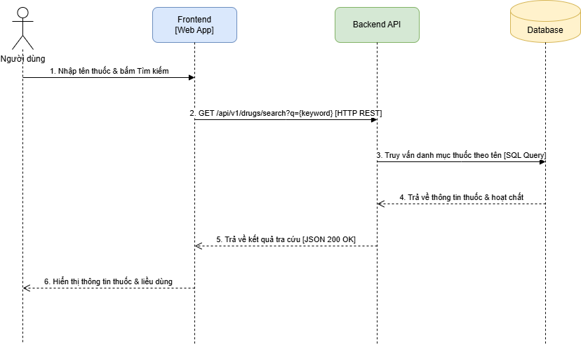
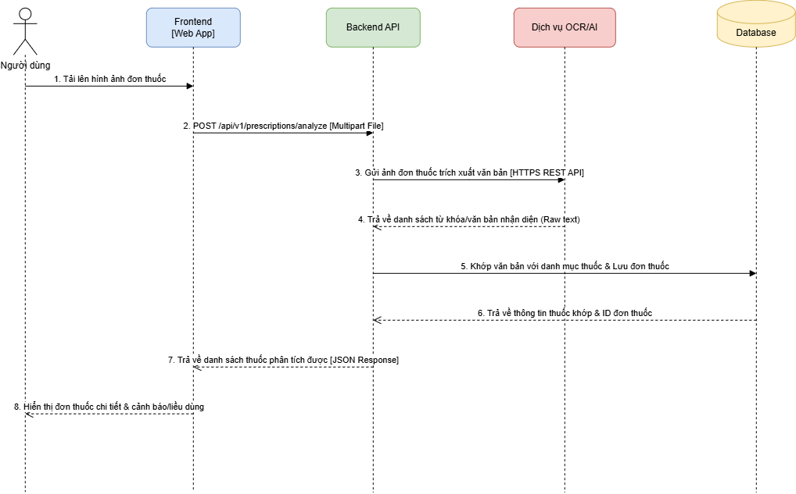
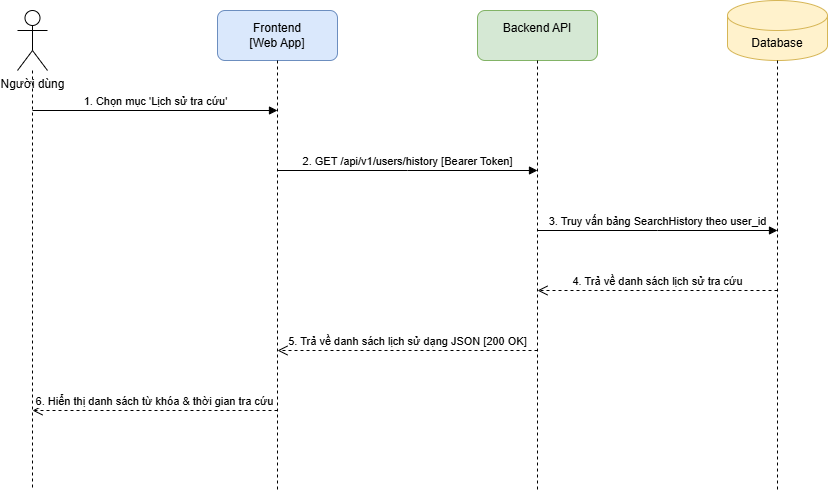

# Biểu Đồ Tuần Tự (Sequence Diagrams)

Tài liệu mô tả chi tiết luồng xử lý và tương tác giữa các thành phần trong hệ thống cho các chức năng chính.

---

## 1. Tra cứu thuốc theo tên

  

### Mục đích
Người dùng nhập tên thuốc trên giao diện để tra cứu các thông tin chi tiết như công dụng, hoạt chất, hàm lượng và liều dùng.

### Các thành phần tham gia (Participants)
* `User`: Người dùng ứng dụng.
* `Frontend`: Giao diện người dùng (Web/Mobile App).
* `Backend API`: Dịch vụ xử lý logic nghiệp vụ và REST API.
* `Database`: Cơ sở dữ liệu lưu trữ thông tin thuốc.

### Luồng xử lý (Flow of Events)
1. **User** nhập từ khóa tên thuốc vào ô tìm kiếm và nhấn "Tìm kiếm".
2. **Frontend** gửi yêu cầu `GET /api/v1/drugs/search?keyword={name}` tới **Backend API**.
3. **Backend API** nhận từ khóa, thực hiện câu lệnh truy vấn SQL xuống **Database**.
4. **Database** thực thi truy vấn và trả về danh sách dữ liệu thuốc phù hợp cho **Backend API**.
5. **Backend API** chuẩn hóa, đóng gói dữ liệu dưới dạng JSON và truyền ngược về **Frontend**.
6. **Frontend** giải mã dữ liệu JSON và hiển thị danh sách kết quả tra cứu cho **User**.

---

## 2. Phân tích đơn thuốc

  

### Mục đích
Người dùng tải ảnh đơn thuốc lên hệ thống để tự động bóc tách tên thuốc, liều lượng bằng công nghệ OCR/AI.

### Các thành phần tham gia (Participants)
* `User`: Người dùng ứng dụng.
* `Frontend`: Giao diện người dùng (Web/Mobile App).
* `Backend API`: Dịch vụ xử lý logic nghiệp vụ và REST API.
* `OCR/AI Service`: Dịch vụ nhận dạng chữ viết và trích xuất dữ liệu từ hình ảnh.
* `Database`: Cơ sở dữ liệu lưu trữ thông tin thuốc và đơn thuốc.

### Luồng xử lý (Flow of Events)
1. **User** tải ảnh đơn thuốc lên **Frontend**, gửi yêu cầu phân tích sang **Backend API** (`POST`).
2. **Backend API** chuyển tiếp tập tin ảnh sang dịch vụ **OCR/AI Service**.
3. **OCR/AI Service** xử lý hình ảnh và trả về danh sách chuỗi văn bản nhận diện được.
4. **Backend API** xử lý thuật toán khớp từ khóa văn bản đó với danh mục thuốc trong **Database** và lưu lại dữ liệu đơn thuốc.
5. **Database** phản hồi lưu thành công.
6. **Backend API** trả kết quả danh sách thuốc chi tiết kèm độ tin cậy về **Frontend** để hiển thị cho **User**.

---

## 3. Xem lịch sử tra cứu

  

### Mục đích
Giúp người dùng xem lại danh sách các thuốc hoặc từ khóa đã từng tìm kiếm trước đây.

### Các thành phần tham gia (Participants)
* `User`: Người dùng ứng dụng.
* `Frontend`: Giao diện người dùng (Web/Mobile App).
* `Backend API`: Dịch vụ xử lý logic nghiệp vụ và REST API.
* `Database`: Cơ sở dữ liệu lưu trữ thông tin lịch sử tra cứu (`SearchHistory`).

### Luồng xử lý (Flow of Events)
1. **User** chọn tính năng lịch sử tra cứu trên **Frontend**.
2. **Frontend** gửi request kèm mã định danh xác thực (`Bearer Token`) sang **Backend API** (`GET`).
3. **Backend API** trích xuất `user_id` và truy vấn bảng lưu lịch sử (`SearchHistory`) trong **Database**.
4. **Database** trả về các bản ghi lịch sử tương ứng.
5. **Backend API** phản hồi danh sách dạng JSON cho **Frontend**.
6. **Frontend** hiển thị danh sách từ khóa và mốc thời gian tra cứu cho **User**.
